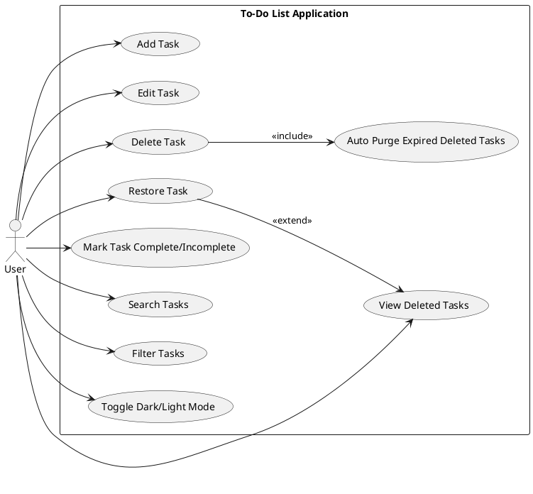
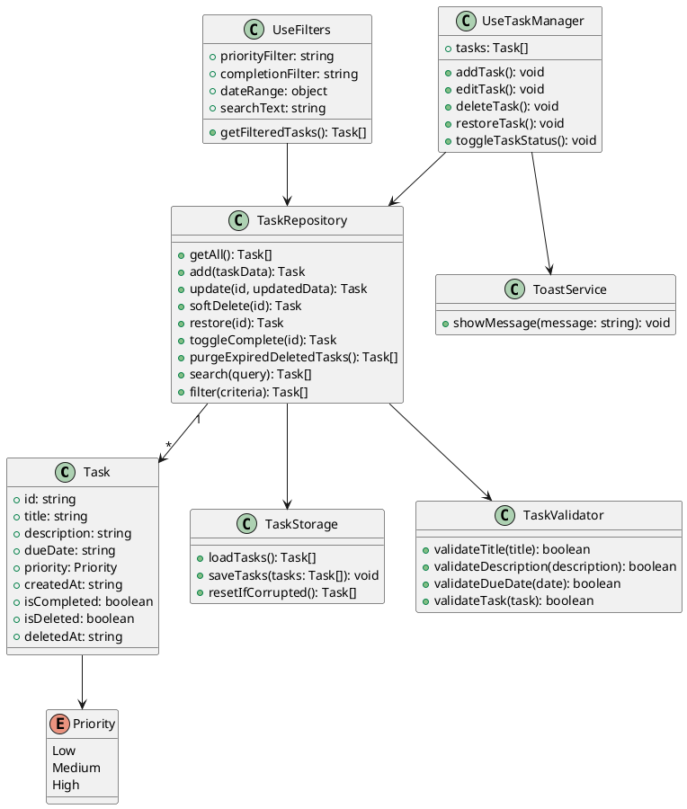
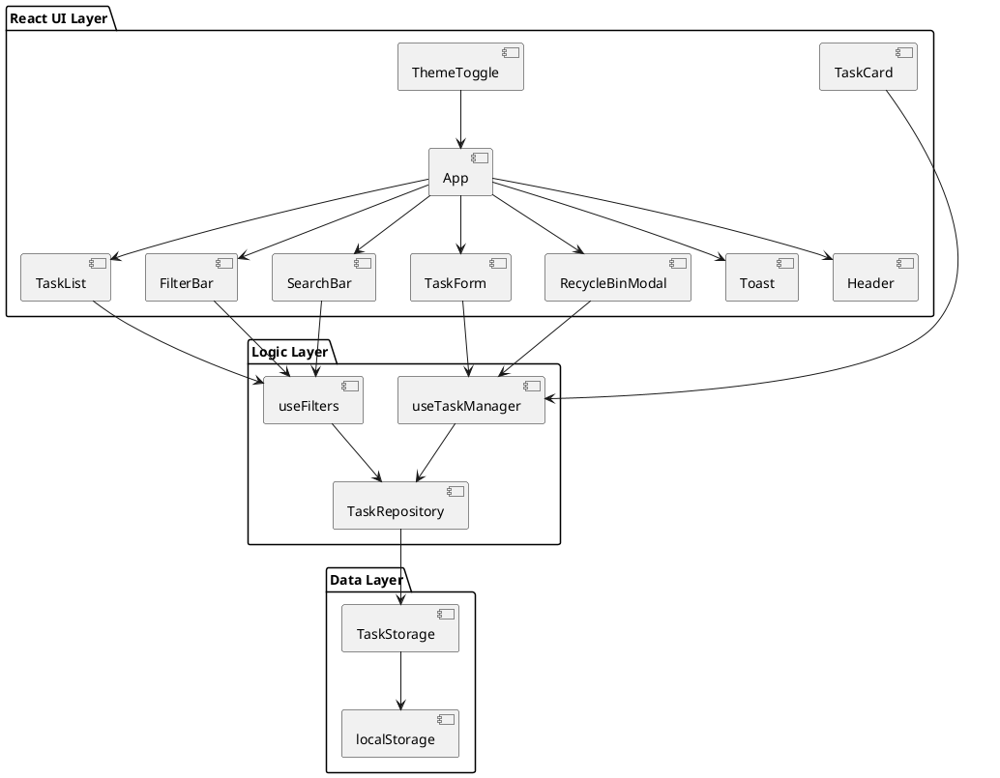
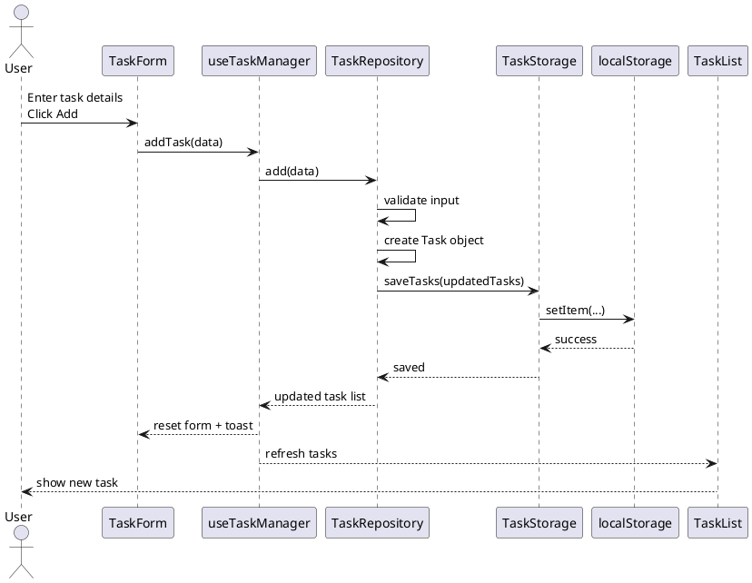
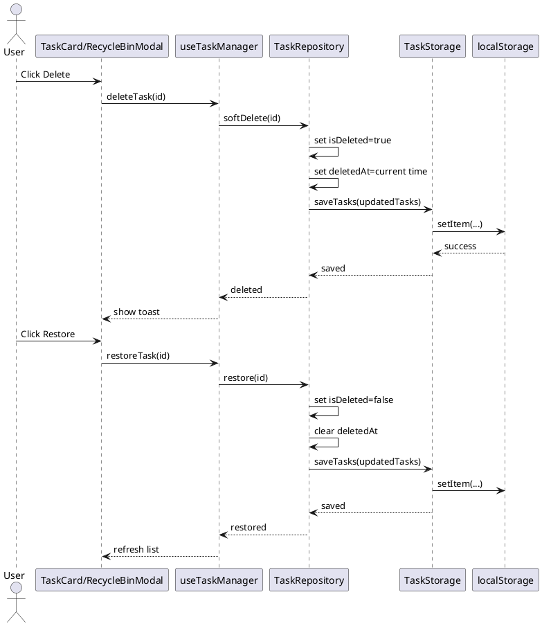
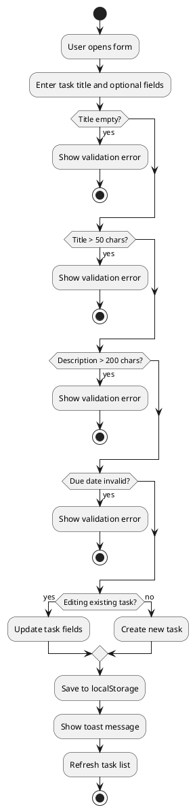
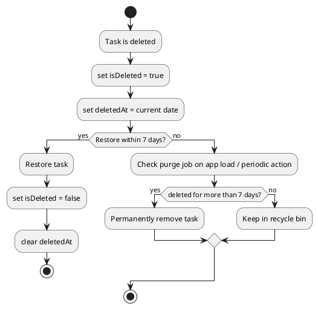
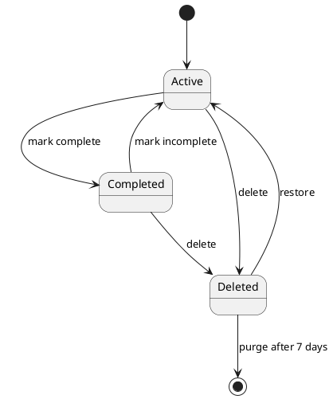
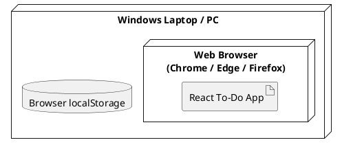

Below is a **complete exam-friendly design pack** for your SRS: **UML diagrams, design instructions, and a step-by-step development plan** for the React To-Do app.

---

# 1) System Design Overview

This app is a **local-first task manager**. That means:

* data is stored only in the browser using `localStorage`
* no login
* no server
* no database
* the app is simple, fast, and suitable for a lab exam
* **Electron integration** for desktop deployment

---

# 3) Electron-Specific Features

### 3.1 Electron Wrapper

The app is packaged as an Electron desktop application. Key features include:

* **Custom Menu Bar**: Includes options for File, Edit, View, and Help.
* **System Tray Integration**: Minimizes to the system tray with quick actions.
* **Native Notifications**: Sends reminders and updates using the OS notification system.

### 3.2 Development Steps

1. **Setup Electron**: Install Electron and configure `main.cjs` and `preload.cjs`.
2. **Package the App**: Use `electron-builder` to create distributable binaries for Windows, macOS, and Linux.
3. **Test Electron Features**: Verify system tray, notifications, and window controls on all supported platforms.

---

# 2) UML Diagrams

I will give the diagrams in **PlantUML format**, because it is easy to convert into actual UML images later.

---

## 2.1 Use Case Diagram

### Purpose

Shows what the user can do with the system.



### Explanation

* The **User** is the only actor.
* Deleting a task includes the rule of moving it to the recycle bin.
* Auto purge is a system behavior, not a user action.
* Viewing deleted tasks is necessary for restore.

---

## 2.2 Class Diagram

### Purpose

Shows the main data structures and logic units.



### Explanation

* `Task` is the core model.
* `TaskStorage` handles `localStorage`.
* `TaskRepository` contains CRUD and business rules.
* `UseTaskManager` controls UI actions.
* `UseFilters` handles search and filter logic.
* `TaskValidator` protects data quality.
* `ToastService` gives user feedback.

---

## 2.3 Component Diagram

### Purpose

Shows how the React parts connect.



### Explanation

* React components handle display.
* Hooks handle behavior.
* Repository handles rules and storage.
* `App` is the top-level container.

---

## 2.4 Sequence Diagram — Add Task

### Purpose

Shows the step-by-step flow when a user adds a task.



### Explanation

* User action starts in the form.
* Validation happens before saving.
* Data is saved to `localStorage`.
* UI updates immediately after state changes.

---

## 2.5 Sequence Diagram — Delete Task and Restore Task

### Purpose

Shows recycle bin behavior.



### Explanation

* Deletion is **soft delete**, not permanent delete.
* Restoring simply reverses the flags.
* Permanent deletion happens later through purge logic.

---

## 2.6 Activity Diagram — Add/Edit Task Flow

### Purpose

Shows user flow and validation flow.



### Explanation

This is a great diagram for exams because it clearly shows:

* validation first
* save later
* update vs create branching

---

## 2.7 Activity Diagram — Deleted Task Lifecycle

### Purpose

Shows how deleted tasks behave over time.



### Explanation

* Deleted tasks are not removed immediately.
* They stay in recycle bin for 7 days.
* After 7 days, they are removed permanently.

---

## 2.8 State Diagram — Task State

### Purpose

Shows the life of a task.



### Explanation

A task can be:

* active
* completed
* deleted

Deleted tasks can be restored before purge.

---

## 2.9 Deployment Diagram

### Purpose

Shows where the app runs.



### Explanation

* The app runs in the browser.
* `localStorage` is inside the browser.
* No server or database is needed.

---

# 3) Design Instructions

These are the rules you should follow while building the app.

---

## 3.1 Data Design

Use a task object like this:

```javascript
{
  id: "uuid-123",
  title: "Study UML",
  description: "Learn use case and class diagram",
  dueDate: "2026-04-10",
  priority: "Medium",
  createdAt: "2026-04-08",
  isCompleted: false,
  isDeleted: false,
  deletedAt: null
}
```

### Important rules

* `id` must be unique
* `createdAt` should be auto-generated
* `deletedAt` should be stored only when the task is deleted
* `priority` must be one of: `Low`, `Medium`, `High`
* `title` is required and must not exceed 50 characters
* `description` is optional and must not exceed 200 characters

---

## 3.2 Storage Design

Use a single `localStorage` key, for example:

```javascript
todo_tasks_v1
```

Store all tasks as one JSON array.

### Example

```json
[
  {
    "id": "1",
    "title": "Buy books",
    "isDeleted": false
  }
]
```

### Rules

* save after every add, edit, delete, restore, and complete toggle
* on startup, load from storage
* if JSON parsing fails, reset to empty array
* always keep deleted tasks in storage until purge time

---

## 3.3 Validation Design

Validation should happen in two places:

1. **UI level validation**

   * disable submit button if title invalid
   * show red error messages

2. **Model level validation**

   * re-check before saving
   * never trust only the UI

### Validation rules

* title required
* title max 50 chars
* description max 200 chars
* due date should be valid date format
* priority must be valid enum value

This is important because even if the UI fails, the system still protects the data.

---

## 3.4 Filtering and Search Design

### Search

* search by title and description
* case-insensitive
* partial match
* debounce by 300ms

### Filters

* priority: Low / Medium / High / All
* status: completed / incomplete / all
* due date range: start and end

### Filter order

Apply filters in this order:

1. search
2. priority
3. status
4. date range
5. exclude deleted tasks from main view

This keeps the logic simple and predictable.

---

## 3.5 UI Design Instructions

### Main layout

* left side: task list
* right side: task form
* on small screens, stack vertically

### Task card

Each task card should show:

* title
* priority badge
* due date if available
* checkbox
* edit icon
* delete icon

### Priority colors

* High → red
* Medium → yellow
* Low → green

### Recycle bin

* separate modal or drawer
* show deleted tasks only
* each item has restore button
* show how many days left before permanent deletion

### Toast messages

* show short messages like:

  * “Task added”
  * “Task updated”
  * “Task deleted”
  * “Task restored”
* disappear after 2 seconds

### Dark mode

* toggle a CSS class on root
* store theme preference in localStorage

---

## 3.6 Code Organization Design

Recommended folder structure:

```text
src/
├── models/
│   ├── Task.js
│   ├── TaskValidator.js
│   └── TaskStorage.js
├── hooks/
│   ├── useTaskManager.js
│   └── useFilters.js
├── components/
│   ├── Header.jsx
│   ├── TaskForm.jsx
│   ├── TaskList.jsx
│   ├── TaskCard.jsx
│   ├── FilterBar.jsx
│   ├── SearchBar.jsx
│   ├── RecycleBinModal.jsx
│   └── Toast.jsx
├── utils/
│   ├── dateUtils.js
│   └── validationUtils.js
├── App.jsx
└── index.jsx
```

### Why this is good

* easy to read
* easy to test
* easy to explain in viva
* each file has one responsibility

---

# 4) Step-by-Step Development Plan

This is the best order to build the app.

---

## Phase 1: Project Setup

### Goal

Create the React project and basic structure.

### Steps

1. create a React app
2. clean default files
3. create folders:

   * components
   * hooks
   * models
   * utils
4. set up basic routing only if needed
5. create the main `App` layout

### Output

A running blank app with the main screen structure.

---

## Phase 2: Build the Task Model

### Goal

Define what a task looks like.

### Steps

1. create `Task` object structure
2. define fields:

   * id
   * title
   * description
   * dueDate
   * priority
   * createdAt
   * isCompleted
   * isDeleted
   * deletedAt
3. create helper to generate unique IDs
4. create helper to generate current date

### Output

A clear task data model ready for CRUD operations.

---

## Phase 3: Build Validation Logic

### Goal

Prevent bad data from entering the system.

### Steps

1. write title validation
2. write description validation
3. write due date validation
4. write priority validation
5. create a reusable validation function
6. show error messages in UI

### Output

A safe form that rejects invalid input.

---

## Phase 4: Build Storage Layer

### Goal

Save and load tasks from `localStorage`.

### Steps

1. create `TaskStorage.loadTasks()`
2. create `TaskStorage.saveTasks()`
3. add JSON parsing safety
4. handle corrupted data by resetting to empty array
5. create storage key constant

### Output

Persistence working locally in the browser.

---

## Phase 5: Build Task Repository

### Goal

Centralize business logic.

### Steps

1. add task
2. edit task
3. delete task
4. restore task
5. toggle complete/incomplete
6. purge tasks older than 7 days
7. search tasks
8. filter tasks

### Output

One place that controls task behavior.

---

## Phase 6: Build State Management Hook

### Goal

Connect repository logic with React UI.

### Steps

1. create `useTaskManager`
2. load tasks on startup
3. expose functions:

   * addTask
   * updateTask
   * deleteTask
   * restoreTask
   * toggleComplete
4. refresh state after every change
5. show toast messages after actions

### Output

UI can now control task operations.

---

## Phase 7: Build Task Form

### Goal

Allow user to add and edit tasks.

### Steps

1. create inputs for title, description, due date, priority
2. add form validation
3. make Add/Update button dynamic
4. when task is clicked, fill the form with existing values
5. reset form after successful submit

### Output

A complete create/edit form.

---

## Phase 8: Build Task List and Task Cards

### Goal

Display tasks clearly.

### Steps

1. create `TaskList`
2. create `TaskCard`
3. show title, badge, due date, checkbox
4. add edit icon
5. add delete icon
6. show only incomplete tasks by default

### Output

Users can view and interact with tasks.

---

## Phase 9: Build Search and Filters

### Goal

Help users find tasks quickly.

### Steps

1. create search bar
2. debounce input by 300ms
3. create priority filter
4. create completion filter
5. create date range filter
6. create “Clear Filters” button
7. combine search and filter logic properly

### Output

A smarter and more useful task list.

---

## Phase 10: Build Recycle Bin

### Goal

Handle deleted tasks correctly.

### Steps

1. create modal or drawer
2. show deleted tasks only
3. display time left before permanent deletion
4. add restore button
5. automatically purge expired tasks on startup

### Output

Recycle bin behavior fully works.

---

## Phase 11: Add Toasts and UI Feedback

### Goal

Improve usability.

### Steps

1. show toast on add
2. show toast on update
3. show toast on delete
4. show toast on restore
5. auto-hide after 2 seconds

### Output

Better user experience.

---

## Phase 12: Add Dark/Light Mode

### Goal

Make the app more polished.

### Steps

1. add theme toggle in header
2. switch CSS classes
3. store theme in localStorage
4. restore theme on startup

### Output

Optional but impressive feature for exams.

---

## Phase 13: Responsive Styling

### Goal

Make the layout work on different window sizes.

### Steps

1. use CSS grid or flexbox
2. 2-column layout for wide screens
3. stacked layout for screens under 800px
4. make cards and form readable on small screens

### Output

Responsive app that satisfies UI-01.

---

## Phase 14: Testing and Final Cleanup

### Goal

Make sure everything works correctly.

### Steps

1. test add/edit/delete/restore
2. test validation errors
3. test search and filters
4. test localStorage reload
5. test corrupted localStorage handling
6. test deleted-task purge after 7 days
7. test responsive layout
8. remove unused code
9. polish UI text and icons

### Output

Final exam-ready application.

---

# 5) Suggested Exam Answer for Architecture

You can describe the architecture like this:

> The application follows an MVC-inspired structure adapted for React. React components act as the View, custom hooks and event handlers act as the Controller, and plain JavaScript task objects with localStorage services act as the Model. This structure separates UI, logic, and persistence, making the system easier to maintain and test.

---

# 6) Key Algorithms to Mention in Viva

## A. Add Task Algorithm

1. user enters task details
2. validate input
3. create task object
4. assign unique id and created date
5. save to `localStorage`
6. update UI

## B. Delete Task Algorithm

1. mark task as deleted
2. store current timestamp in `deletedAt`
3. save to `localStorage`
4. show task in recycle bin

## C. Purge Expired Deleted Tasks

1. load all tasks
2. check deleted tasks
3. compare `deletedAt` with current date
4. remove tasks older than 7 days
5. save cleaned list

## D. Search and Filter Algorithm

1. start with active tasks
2. apply search text match
3. apply priority filter
4. apply status filter
5. apply date range filter
6. show final result

---

# 7) Traceability Summary

| Requirement               | Where It Is Implemented                       |
| ------------------------- | --------------------------------------------- |
| FR-01 Add task            | `TaskForm`, `useTaskManager`, `TaskValidator` |
| FR-03 Edit task           | `TaskCard` + form prefill + `updateTask()`    |
| FR-04 Delete task         | `deleteTask()` + recycle bin logic            |
| FR-05 7-day retention     | purge algorithm in repository                 |
| FR-06 Restore task        | `restoreTask()`                               |
| FR-07 Complete/incomplete | checkbox in `TaskCard`                        |
| FR-08 Persist all tasks   | `TaskStorage.saveTasks()`                     |
| FR-09 Load on startup     | `TaskStorage.loadTasks()`                     |
| FR-10 Filtering           | `useFilters`                                  |
| FR-11 Search              | `SearchBar` + filtering logic                 |

---

# 8) Final Implementation Advice

Keep the app simple. For a lab exam, the best version is not the most advanced one. It is the one that is:

* correct
* easy to explain
* easy to test
* cleanly structured

Focus on:

* solid validation
* correct localStorage logic
* clear separation of UI and logic
* simple but complete UX

If you want, I can turn this into a **full PlantUML report**, a **Word-style lab document**, or a **React folder-by-folder coding roadmap**.
